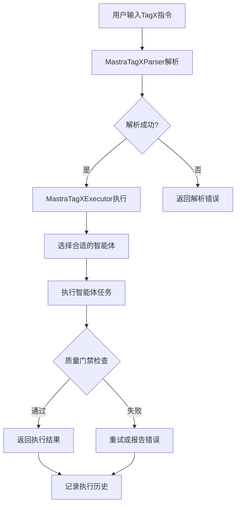
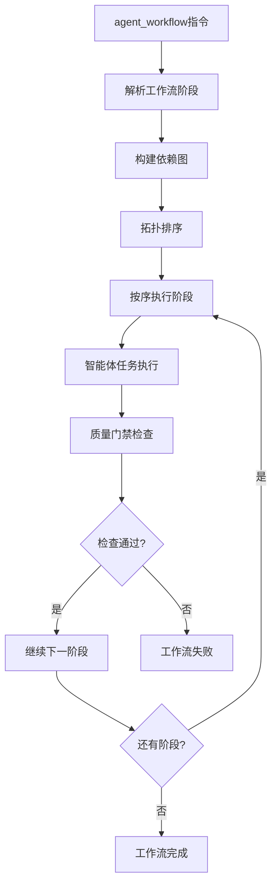

# 基于Mastra的TagX系统技术架构文档

## 系统概览

基于Mastra.ai框架构建的TagX系统是一个智能编程助手，通过XML标签提供结构化的AI交互体验。系统实现了多智能体协作、智能代码生成、质量检查等核心功能。

## 核心架构

### 1. 分层架构设计

```
┌─────────────────────────────────────────────────────────────┐
│                    前端界面层 (we-dev-client)                │
├─────────────────────────────────────────────────────────────┤
│                    API接口层 (TagX Tools)                   │
├─────────────────────────────────────────────────────────────┤
│                    业务逻辑层 (TagX Processor)               │
├─────────────────────────────────────────────────────────────┤
│                    智能体层 (Mastra Agent Network)          │
├─────────────────────────────────────────────────────────────┤
│                    基础设施层 (Mastra Core)                 │
└─────────────────────────────────────────────────────────────┘
```

### 2. 核心组件

#### 2.1 TagX解析器 (MastraTagXParser)
- **职责**: XML指令解析和验证
- **技术**: fast-xml-parser + TypeScript
- **支持标签**: smart_code_gen, bolt_artifact, agent_workflow, quality_check

#### 2.2 TagX执行器 (MastraTagXExecutor)
- **职责**: 智能体调用和任务执行
- **技术**: Mastra Agent + Memory
- **特性**: 错误处理、重试机制、质量门禁

#### 2.3 智能体网络 (MastraAgentNetwork)
- **职责**: 多智能体管理和协作
- **智能体角色**: 
  - senior-developer (资深开发工程师)
  - code-reviewer (代码审查专家)
  - security-auditor (安全审计专家)
  - qa-engineer (质量保证工程师)
  - product-manager (产品经理)

#### 2.4 质量检查系统 (MastraQualitySystem)
- **职责**: 代码质量分析和报告
- **检查类别**: 代码质量、安全性、性能、最佳实践、文档
- **特性**: 自动修复建议、质量评分、详细报告

## 数据流设计

### 1. TagX指令处理流程



### 2. 多智能体协作流程



## 技术实现细节

### 1. TypeScript类型系统

```typescript
// 核心接口定义
interface TagXElement {
  tagName: string;
  attributes: Record<string, string>;
  children: TagXElement[];
}

interface TagXContext {
  projectPath: string;
  userId?: string;
  sessionId: string;
  preferences?: UserPreferences;
  history?: TagXResult[];
}

interface TagXResult {
  success: boolean;
  tagName: string;
  duration: number;
  output?: any;
  error?: string;
  quality_score?: number;
  files_changed?: string[];
  next_steps?: string[];
}
```

### 2. 错误处理机制

```typescript
// 分层错误处理
try {
  const elements = parser.parse(xmlString);
  const results = await executor.execute(elements, context);
  return results;
} catch (parseError) {
  return [{
    success: false,
    tagName: 'unknown',
    duration: 0,
    error: `解析失败: ${parseError.message}`
  }];
} catch (executionError) {
  return [{
    success: false,
    tagName: element.tagName,
    duration: Date.now() - startTime,
    error: `执行失败: ${executionError.message}`
  }];
}
```

### 3. 性能优化策略

#### 3.1 解析优化
- 使用fast-xml-parser的流式解析
- 缓存解析结果
- 延迟加载复杂标签

#### 3.2 执行优化
- 智能体响应缓存
- 并行执行独立任务
- 资源池管理

#### 3.3 内存管理
- 及时释放大对象
- 使用WeakMap避免内存泄露
- 限制并发执行数量

## 质量保证

### 1. 测试策略

#### 1.1 单元测试
- 解析器测试: 100%覆盖所有标签类型
- 执行器测试: 模拟智能体响应
- 工具方法测试: 边界条件验证

#### 1.2 集成测试
- 端到端TagX指令处理
- 多智能体协作流程
- 错误恢复机制

#### 1.3 性能测试
- 解析性能基准测试
- 并发执行压力测试
- 内存使用监控

### 2. 代码质量标准

- **TypeScript严格模式**: 启用所有严格检查
- **ESLint规则**: 遵循Airbnb代码规范
- **Prettier格式化**: 统一代码风格
- **JSDoc注释**: 100%API文档覆盖

## 安全考虑

### 1. 输入验证
- XML注入防护
- 参数类型验证
- 文件路径安全检查

### 2. 权限控制
- 用户会话隔离
- 资源访问限制
- 敏感操作审计

### 3. 数据保护
- 内存中敏感数据清理
- 日志脱敏处理
- 传输加密

## 扩展性设计

### 1. 新TagX标签支持
```typescript
// 添加新标签只需三步:
// 1. 定义接口
interface NewTagElement extends TagXElement {
  // 标签特定属性
}

// 2. 添加解析逻辑
private parseNewTag(data: any): NewTagElement {
  // 解析实现
}

// 3. 添加执行逻辑
private async executeNewTag(element: NewTagElement, context: TagXContext): Promise<TagXResult> {
  // 执行实现
}
```

### 2. 新智能体角色
```typescript
// 添加新智能体角色
const newRole: AgentRole = {
  name: 'new-specialist',
  description: '新专家角色',
  instructions: '专业指令...',
  capabilities: ['capability1', 'capability2'],
  model: openai('gpt-4')
};

agentNetwork.addRole(newRole);
```

## 部署和运维

### 1. 部署架构
- Docker容器化部署
- Kubernetes集群管理
- 负载均衡和自动扩缩容

### 2. 监控和日志
- 性能指标监控
- 错误率和响应时间追踪
- 结构化日志记录

### 3. 维护策略
- 滚动更新部署
- 数据库迁移管理
- 配置热更新

## 未来规划

### 1. 短期目标 (1-3个月)
- 前端UI完整集成
- 实时协作功能
- 性能优化和缓存

### 2. 中期目标 (3-6个月)
- 插件系统开发
- 多语言支持
- 高级工作流编排

### 3. 长期目标 (6-12个月)
- AI模型微调
- 企业级功能
- 生态系统建设

---

**文档版本**: v1.0  
**最后更新**: 2025-01-18  
**维护者**: Mastra TagX开发团队
