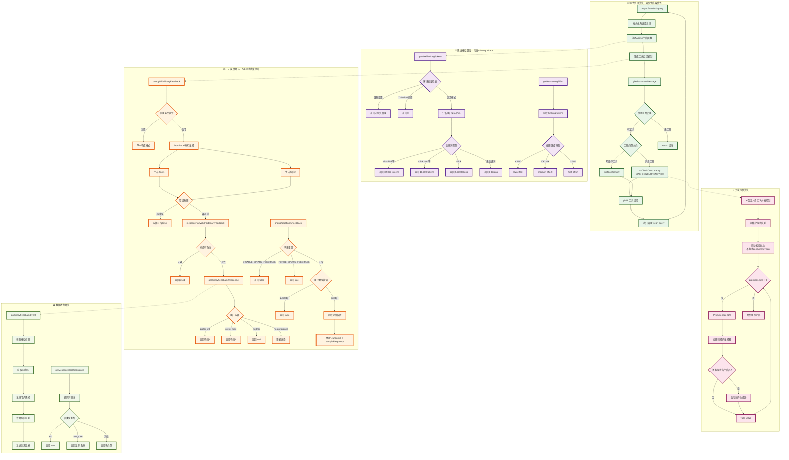
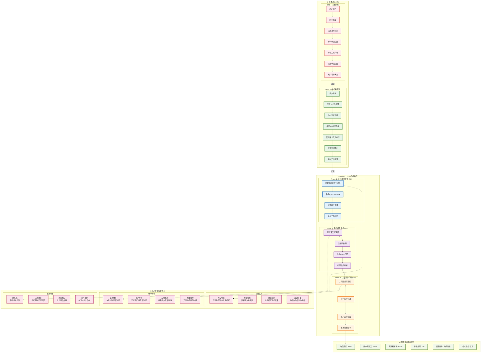

# anon-kode 架构图集合

本文件包含了基于 `arch.md` 文档创建的三个核心架构图的 Mermaid 源代码。

## 图1: anon-kode 核心技术架构图

```mermaid
graph TB
    %% 用户交互层
    User[👤 用户输入] --> InputAnalyzer{输入分析器}
    
    %% 思维模型决策
    InputAnalyzer --> ThinkingManager[🧠 思维管理器]
    ThinkingManager --> |"think" → 4K tokens| BasicThinking[基础思维模式]
    ThinkingManager --> |"think hard" → 10K tokens| MediumThinking[中等思维模式]
    ThinkingManager --> |"ultrathink" → 32K tokens| DeepThinking[超级思维模式]
    ThinkingManager --> |无思维关键词| NoThinking[无思维模式]
    
    %% 二元反馈决策
    InputAnalyzer --> BinaryFeedbackDecision{二元反馈决策}
    BinaryFeedbackDecision --> |启用| ParallelGeneration[并行生成]
    BinaryFeedbackDecision --> |禁用| SingleGeneration[单一生成]
    
    %% 核心流式调度引擎
    BasicThinking --> StreamingEngine[🔄 流式调度引擎<br/>async function* query]
    MediumThinking --> StreamingEngine
    DeepThinking --> StreamingEngine
    NoThinking --> StreamingEngine
    
    %% 并行生成路径
    ParallelGeneration --> AIModel1[🤖 AI模型实例1]
    ParallelGeneration --> AIModel2[🤖 AI模型实例2]
    AIModel1 --> Response1[响应1]
    AIModel2 --> Response2[响应2]
    Response1 --> BinaryFeedbackUI[⚖️ 二元反馈界面]
    Response2 --> BinaryFeedbackUI
    
    %% 单一生成路径
    SingleGeneration --> AIModel[🤖 AI模型]
    AIModel --> SingleResponse[单一响应]
    
    %% 用户选择处理
    BinaryFeedbackUI --> UserChoice{用户选择}
    UserChoice --> |prefer-left| SelectedResponse1[选择响应1]
    UserChoice --> |prefer-right| SelectedResponse2[选择响应2]
    UserChoice --> |neither| RejectBoth[拒绝两个响应]
    UserChoice --> |no-preference| RandomSelect[随机选择]
    
    %% 流式输出处理
    SelectedResponse1 --> StreamingEngine
    SelectedResponse2 --> StreamingEngine
    SingleResponse --> StreamingEngine
    RandomSelect --> StreamingEngine
    
    %% 工具使用检测
    StreamingEngine --> ToolDetection{工具使用检测}
    ToolDetection --> |有工具使用| ToolClassification{工具分类}
    ToolDetection --> |无工具使用| DirectOutput[直接输出]
    
    %% 工具并发控制
    ToolClassification --> |只读工具| ConcurrentExecution[🔀 并发执行<br/>MAX_CONCURRENCY=10]
    ToolClassification --> |写操作工具| SerialExecution[📝 串行执行]
    
// [MermaidChart: 23d463ca-514a-409f-831a-027b18150fdd]
// [MermaidChart: a7e469d1-3a66-45f4-b400-8c8eaec436de]
// [MermaidChart: 0bbc98e8-eb21-421a-8dc0-d2c329b4a9a6]
// [MermaidChart: a7e469d1-3a66-45f4-b400-8c8eaec436de]
// [MermaidChart: a7e469d1-3a66-45f4-b400-8c8eaec436de]
// [MermaidChart: a7e469d1-3a66-45f4-b400-8c8eaec436de]
// [MermaidChart: a7e469d1-3a66-45f4-b400-8c8eaec436de]
    %% 并发执行细节
    ConcurrentExecution --> ToolPool[工具池]
    ToolPool --> Tool1[工具1]
    ToolPool --> Tool2[工具2]
    ToolPool --> Tool3[工具N...]
    Tool1 --> ToolResult1[结果1]
    Tool2 --> ToolResult2[结果2]
    Tool3 --> ToolResult3[结果N...]
    
    %% 串行执行
    SerialExecution --> SequentialTools[顺序工具执行]
    SequentialTools --> ToolResultSeq[串行结果]
    
    %% 结果聚合和递归
    ToolResult1 --> ResultAggregator[结果聚合器]
    ToolResult2 --> ResultAggregator
    ToolResult3 --> ResultAggregator
    ToolResultSeq --> ResultAggregator
    DirectOutput --> ResultAggregator
    
    %% 递归处理
    ResultAggregator --> RecursiveCheck{需要递归?}
    RecursiveCheck --> |是| StreamingEngine
    RecursiveCheck --> |否| FinalOutput[📤 最终输出]
    
    %% 数据收集和分析
    BinaryFeedbackUI --> DataCollector[📊 数据收集器]
    DataCollector --> UserPreferenceDB[(用户偏好数据库)]
    DataCollector --> QualityMetrics[质量指标分析]
    
    %% 思维工具特殊处理
    StreamingEngine --> ThinkTool{ThinkTool启用?}
    ThinkTool --> |是| ThinkToolExecution[思维工具执行]
    ThinkTool --> |否| NormalExecution[正常执行]
    ThinkToolExecution --> ThoughtLogging[思维过程记录]
    
    %% 样式定义
    classDef userLayer fill:#e1f5fe,stroke:#01579b,stroke-width:2px
    classDef thinkingLayer fill:#f3e5f5,stroke:#4a148c,stroke-width:2px
    classDef streamingLayer fill:#e8f5e8,stroke:#1b5e20,stroke-width:2px
    classDef binaryLayer fill:#fff3e0,stroke:#e65100,stroke-width:2px
    classDef toolLayer fill:#fce4ec,stroke:#880e4f,stroke-width:2px
    classDef dataLayer fill:#f1f8e9,stroke:#33691e,stroke-width:2px
    
    %% 应用样式
    class User,InputAnalyzer userLayer
    class ThinkingManager,BasicThinking,MediumThinking,DeepThinking,NoThinking,ThinkTool,ThinkToolExecution,ThoughtLogging thinkingLayer
    class StreamingEngine,RecursiveCheck,ResultAggregator streamingLayer
    class BinaryFeedbackDecision,ParallelGeneration,BinaryFeedbackUI,UserChoice,SelectedResponse1,SelectedResponse2 binaryLayer
    class ToolDetection,ToolClassification,ConcurrentExecution,SerialExecution,ToolPool,Tool1,Tool2,Tool3 toolLayer
    class DataCollector,UserPreferenceDB,QualityMetrics dataLayer
```

## 图2: 三大核心算法详细流程图



## 图3: 技术对比及升级路径图



## 使用说明

### 如何使用这些架构图

1. **在线渲染**: 将 Mermaid 代码复制到 [Mermaid Live Editor](https://mermaid.live/) 中查看
2. **本地渲染**: 使用支持 Mermaid 的 Markdown 编辑器（如 Typora、VS Code 等）
3. **文档集成**: 直接在支持 Mermaid 的文档系统中使用（如 GitBook、Notion 等）
4. **导出图片**: 通过 Mermaid CLI 或在线工具导出为 PNG/SVG 格式

### 架构图说明

- **图1**: 展示完整的系统架构和数据流，适合技术概览
- **图2**: 详细的算法流程，适合开发人员理解具体实现
- **图3**: 技术对比和升级路径，适合项目规划和决策

### 颜色编码

- 🔵 蓝色：用户交互层
- 🟣 紫色：思维模型相关
- 🟢 绿色：流式处理相关
- 🟠 橙色：二元反馈相关
- 🔴 红色：工具执行相关
- 🟡 黄色：数据收集相关

---

**创建时间**: 2024年12月
**基于文档**: arch.md
**图表格式**: Mermaid
**状态**: 已完成 ✅
